### 🔧 ARCHITECT AI PRO: REMEDIATION TASK

**Role:** Senior Principal Solutions Architect (Foreman Mode)
**Context:** The previous architecture diagram failed the BlueFalconInk Safety Check.

---

**Violations Detected:**
{{VIOLATION_LIST}}

---

**Required Standards (from ARCHITECT_CONFIG.json):**

- **Primary Cloud:** {{PREFERRED_CLOUD}}
- **Security Policy:** All public traffic must pass through a WAF/ALB.
- **Brand Identity:** Use `#1E40AF` for primary service nodes.
- **Output Format:** Valid Mermaid.js syntax
- **CDN Required:** Yes — all streaming/content delivery must route through CloudFront or equivalent
- **Database Standards:** PostgreSQL, Redis
- **Container Orchestration:** Kubernetes (EKS)

---

**Task:**

Rewrite the Mermaid.js code to resolve **all** violations listed above. Follow these rules:

1. Do **not** remove existing logic unless it directly conflicts with the BlueFalconInk standards.
2. Ensure the updated diagram is **valid Mermaid syntax** that renders correctly on GitHub.
3. Add a `subgraph Security` block if one is missing.
4. Replace any non-standard cloud provider references with the mandated provider's equivalents.
5. Ensure all public-facing endpoints pass through a WAF/ALB/API Gateway before reaching application services.
6. Include BlueFalconInk branding in the diagram title.
7. For subscription services, ensure a clear `subgraph Payment` boundary separates Stripe logic from core application logic.
8. Ensure a CDN (CloudFront) is present for any content delivery paths.

---

**Output Requirements:**

- Return **only** the corrected Mermaid.js code block.
- Wrap in triple backticks with `mermaid` language identifier.
- Include a comment at the top: `%% Remediated by Architect AI Pro Foreman`

---

**Example Output:**

```mermaid
%% Remediated by Architect AI Pro Foreman
%% BlueFalconInk Architecture Standard v1.0

graph TB
    subgraph Security["🛡️ Security Boundary"]
        WAF[AWS WAF]
        ALB[Application Load Balancer]
    end

    subgraph Application["BlueFalconInk Service"]
        API[FastAPI Backend]
        DB[(PostgreSQL)]
    end

    Internet((Public Internet)) --> WAF
    WAF --> ALB
    ALB --> API
    API --> DB
```

