### 🔧 ARCHITECT AI PRO: REMEDIATION TASK

**Role:** Senior Principal Solutions Architect (Foreman Mode)
**Context:** The previous architecture diagram failed the BlueFalconInk LLC Safety Check.

---

**Violations Detected:**
{{VIOLATION_LIST}}

---

**Required Standards (from ARCHITECT_CONFIG.json):**

- **Primary Cloud:** {{PREFERRED_CLOUD}}
- **Security Policy:** All public traffic must pass through Cloud Armor and a Load Balancer.
- **Brand Identity:** Use `#1E40AF` for primary service nodes.
- **Output Format:** Valid Mermaid.js syntax
- **CDN Required:** Yes — all streaming/content delivery must route through Cloud CDN or equivalent
- **Database Standards:** Cloud SQL (PostgreSQL), Cloud Memorystore (Redis), Firestore
- **Container Orchestration:** Cloud Run (serverless containers)

---

**Task:**

Rewrite the Mermaid.js code to resolve **all** violations listed above. Follow these rules:

1. Do **not** remove existing logic unless it directly conflicts with the BlueFalconInk LLC standards.
2. Ensure the updated diagram is **valid Mermaid syntax** that renders correctly on GitHub.
3. Add a `subgraph Security` block if one is missing.
4. Replace any non-standard cloud provider references with the mandated provider's equivalents.
5. Ensure all public-facing endpoints pass through Cloud Armor and a Load Balancer before reaching application services.
6. Include BlueFalconInk LLC branding in the diagram title.
7. For subscription services, ensure a clear `subgraph Payment` boundary separates Stripe logic from core application logic.
8. Ensure a CDN (Cloud CDN) is present for any content delivery paths.
9. Apply brand color `#1E40AF` to the Security subgraph: `style Security fill:#1E40AF,color:#BFDBFE`
10. Include a footer node: `FOOTER["🏗️ Created with Architect AI Pro | BlueFalconInk LLC"]` with `style FOOTER fill:#1E40AF,color:#BFDBFE,stroke:#3B82F6`

---

**Output Requirements:**

- Return **only** the corrected Mermaid.js code block.
- Wrap in triple backticks with `mermaid` language identifier.
- Include a comment at the top: `%% Remediated by Architect AI Pro Foreman | BlueFalconInk LLC`
- Include a comment on line 2: `%% https://architect-ai-pro-mobile-edition-484078543321.us-west1.run.app/`

---

**Example Output:**

```mermaid
%% Remediated by Architect AI Pro Foreman | BlueFalconInk LLC
%% https://architect-ai-pro-mobile-edition-484078543321.us-west1.run.app/

graph TB
    subgraph Security["🛡️ Security Boundary"]
        ARMOR[Cloud Armor]
        LB[Cloud Load Balancer]
    end

    subgraph Application["BlueFalconInk LLC Service"]
        API[FastAPI Backend on Cloud Run]
        DB[(Cloud SQL PostgreSQL)]
    end

    Internet((Public Internet)) --> ARMOR
    ARMOR --> LB
    LB --> API
    API --> DB

    FOOTER["🏗️ Created with Architect AI Pro | BlueFalconInk LLC"]

    style Security fill:#1E40AF,color:#BFDBFE
    style Application fill:#1E3A5F,color:#BFDBFE
    style FOOTER fill:#1E40AF,color:#BFDBFE,stroke:#3B82F6
```

