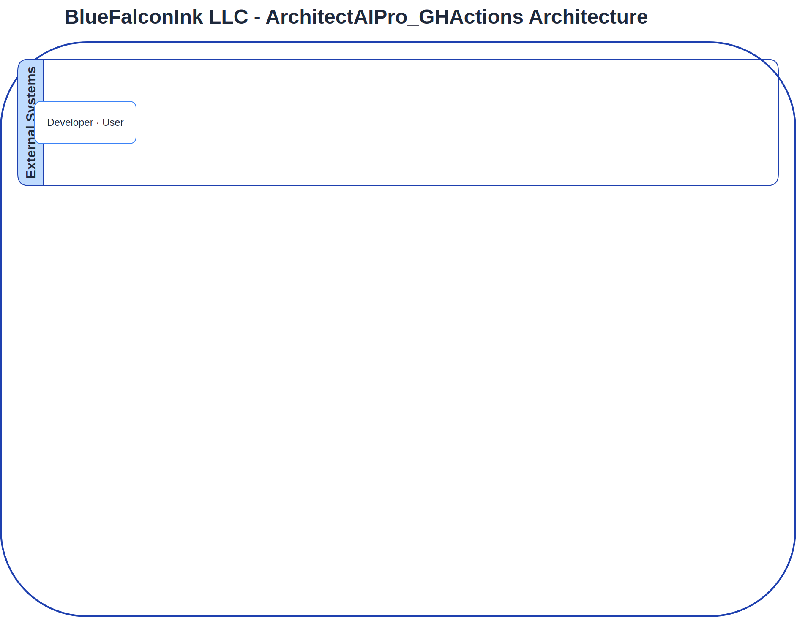

# 🏗️ BlueFalconInk LLC — ArchitectAIPro_GHActions Architecture

> **Created with [Architect AI Pro](https://architect-ai-pro-mobile-edition-484078543321.us-west1.run.app/)** — the flagship architecture tool by **BlueFalconInk LLC**
> Auto-generated on 2026-02-27 21:08 UTC | [GitHub Action source](https://github.com/koreric75/ArchitectAIPro_GHActions)


## Architecture Diagram



<details>
<summary>📄 View Mermaid Source Code</summary>

```mermaid
%% Generated by Architect AI Pro | BlueFalconInk LLC
%% https://architect-ai-pro-mobile-edition-484078543321.us-west1.run.app/
graph TD
    subgraph "BlueFalconInk LLC - ArchitectAIPro_GHActions Architecture"
        subgraph "User & Developer"
            Developer[Developer]
            User[End User]
        end

        subgraph "GitHub Platform"
            GitHubRepo[ArchitectAIPro_GHActions Repo]
            GitHubActions[GitHub Actions CI/CD]
            GitHubAPI[GitHub API]
            GitHubSecrets[GitHub Actions Secrets]
        end

        subgraph "CI/CD & Automation"
            ArchitectAIEngine[Architect AI Pro Engine · Scripts]
            ForemanAudit[Foreman Audit Engine · Scripts]
            CloudBuild[Cloud Build]
            Terraform[Terraform IaC]
        end

        subgraph "Application Layer"
            style Application Layer fill:#1E3A5F,color:#BFDBFE
            CloudLoadBalancer[Cloud Load Balancer]
            CloudRunCHAD[Cloud Run · CHAD Dashboard]
            CloudRunGallery[Cloud Run · Arch Gallery]
            CloudCDN[Cloud CDN]
        end

        subgraph "Data & AI Services"
            style Data & AI Services fill:#0F172A,color:#BFDBFE
            GoogleGemini[Google Gemini API]
            ArtifactRegistry[Artifact Registry]
            SecretManager[Secret Manager]
            DrawioCLI[Draw.io CLI - headless]
        end

        subgraph "Security"
            style Security fill:#1E40AF,color:#BFDBFE
            CloudArmor[Cloud Armor]
            WIF[Workload Identity Federation]
        end

        %% User & Developer Flows
        Developer -->|Pushes Code, PRs| GitHubRepo
        User -->|Accesses Web UI| CloudLoadBalancer

        %% Public Access Flow
        CloudLoadBalancer -->|HTTPS| CloudArmor
        CloudArmor -->|Routes Traffic| CloudRunCHAD
        CloudArmor -->|Routes Traffic| CloudRunGallery
        CloudRunCHAD -->|Serves Web UI| CloudCDN
        CloudRunGallery -->|Serves Web UI| CloudCDN

        %% GitHub Platform Flows
        GitHubRepo -->|Code Changes| GitHubActions
        GitHubActions -->|Authenticates via| WIF
        GitHubActions -->|Retrieves Secrets| GitHubSecrets
        GitHubActions -->|Triggers Diagram Gen| ArchitectAIEngine
        GitHubActions -->|Triggers Image Build| CloudBuild
        GitHubActions -->|Triggers Infra Deploy| Terraform

        %% CI/CD & Automation Flows
        ArchitectAIEngine -->|Generates Diagrams| GoogleGemini
        ArchitectAIEngine -->|Converts Mermaid to PNG| DrawioCLI
        ArchitectAIEngine -->|Commits Generated Docs| GitHubRepo
        ArchitectAIEngine -->|Audits Diagrams| ForemanAudit
        ForemanAudit -->|Reports Violations| ArchitectAIEngine
        ArchitectAIEngine -->|Audits Repos & Generates Dashboard| GitHubAPI
        CloudBuild -->|Builds Docker Images from Repo| GitHubRepo
        CloudBuild -->|Pushes Images| ArtifactRegistry
        Terraform -->|Deploys/Manages Infra| CloudRunCHAD
        Terraform -->|Deploys/Manages Infra| CloudRunGallery
        Terraform -->|Deploys/Manages Infra| ArtifactRegistry
        Terraform -->|Deploys/Manages Infra| SecretManager
        Terraform -->|Deploys/Manages Infra| WIF
        Terraform -->|Deploys/Manages Infra| CloudArmor
        Terraform -->|Deploys/Manages Infra| CloudLoadBalancer

        %% Application Layer Internal/External Flows
        CloudRunCHAD -->|Calls Scripts for Audit/Dashboard| ArchitectAIEngine
        CloudRunCHAD -->|Fetches Secrets| SecretManager
        CloudRunCHAD -->|Interacts with GitHub API| GitHubAPI
        CloudRunGallery -->|Fetches Secrets| SecretManager
        CloudRunGallery -->|Fetches Repo Data| GitHubAPI
        ArtifactRegistry -->|Deploys Images to| CloudRunCHAD
        ArtifactRegistry -->|Deploys Images to| CloudRunGallery

        %% Security Flows
        WIF -->|Provides ephemeral credentials| GitHubActions
        SecretManager -->|Provides runtime secrets to| CloudRunCHAD
        SecretManager -->|Provides runtime secrets to| CloudRunGallery

    end
    FOOTER[🏗️ Created with Architect AI Pro · BlueFalconInk LLC]
    style FOOTER fill:#1E40AF,color:#BFDBFE,stroke:#3B82F6
```

</details>

---

## 📋 BlueFalconInk LLC Building Code Compliance

| Standard | Requirement | Status |
|----------|-------------|--------|
| Cloud Provider | GCP | ✅ Enforced |
| IaC | Terraform | ✅ Enforced |
| Orchestration | Cloud Run | ✅ Enforced |
| API Standard | REST/GraphQL | ✅ Enforced |
| Security Boundary | Required | ✅ Enforced |
| Cloud Armor / LB for Public | Required | ✅ Enforced |
| Brand Identity | BlueFalconInk LLC | ✅ Enforced |

---

## 🏢 About

This architecture diagram was generated by **[Architect AI Pro](https://architect-ai-pro-mobile-edition-484078543321.us-west1.run.app/)**, the flagship
architecture tool built by **BlueFalconInk LLC**. Architect AI Pro analyzes your source code and
produces compliant, production-ready architecture diagrams using Google Gemini AI.

📎 **Live App:** [https://architect-ai-pro-mobile-edition-484078543321.us-west1.run.app/](https://architect-ai-pro-mobile-edition-484078543321.us-west1.run.app/)
📎 **GitHub Actions:** [https://github.com/koreric75/ArchitectAIPro_GHActions](https://github.com/koreric75/ArchitectAIPro_GHActions)

---

*© BlueFalconInk LLC. All rights reserved. Automated Governance. Living Blueprints. Ruthless Consistency.*
