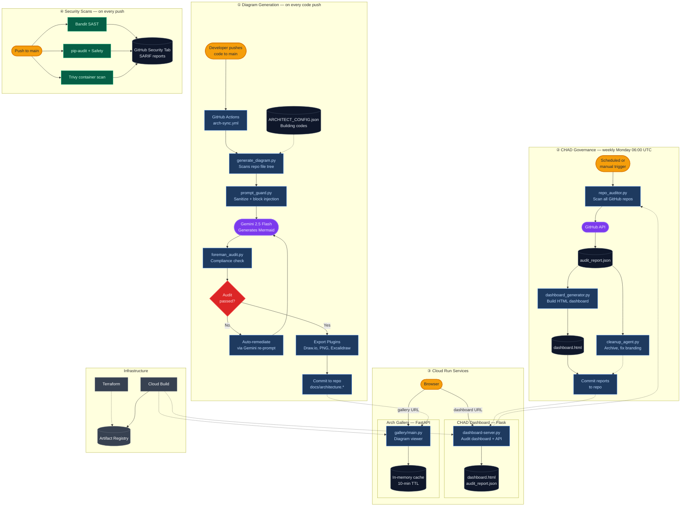

# 🏗️ Architect AI Pro — System Architecture

> **BlueFalconInk LLC** | [Live App](https://architect-ai-pro-mobile-edition-484078543321.us-west1.run.app/) | [GitHub Actions](https://github.com/koreric75/ArchitectAIPro_GHActions)

## What This System Does

Architect AI Pro is a **GitHub Actions-based pipeline** that automatically generates, audits, and commits architecture diagrams for any repository. It has three main functions:

| # | Workflow | Trigger | What It Does |
|---|---------|---------|-------------|
| ① | **Diagram Generation** | Every push to `main` | Scans repo source → calls Gemini API → generates Mermaid diagram → audits for compliance → commits `docs/architecture.md` |
| ② | **CHAD Governance** | Weekly (Monday 06:00 UTC) | Audits all GitHub repos for health (staleness, branding, secrets) → generates advisory dashboard → optionally archives/cleans repos |
| ③ | **Security Scans** | Every push to `main` | Runs Bandit (SAST), pip-audit + Safety (dependencies), Trivy (containers) → uploads SARIF to GitHub Security tab |

Two Cloud Run services serve the generated artifacts:
- **CHAD Dashboard** (Flask) — Serves the audit dashboard + on-demand audit API
- **Architecture Gallery** (FastAPI) — Fetches and renders diagrams from all BlueFalconInk repos

---

## Architecture Diagram

The diagram below shows how data flows through each of the four workflows, and how they connect to each other and to deployed services.

📄 View Mermaid Source

---

## Key Components

### ① Diagram Generation Pipeline

| Script | Purpose |
|--------|---------|
| `generate_diagram.py` | Scans repo file tree, Dockerfiles, Terraform, API routes. Builds a context payload and sends it to Gemini 2.5 Flash to generate a Mermaid architecture diagram. |
| `prompt_guard.py` | Sanitizes repo content before sending to LLM. Detects prompt injection patterns, strips secrets. |
| `foreman_audit.py` | Validates the generated diagram against `ARCHITECT_CONFIG.json` building codes (GCP-only, Terraform, security boundaries, branding). |
| `plugin_loader.py` | Secure sandboxed execution of export plugins (Draw.io, Excalidraw) with SHA-256 hash verification. |

### ② CHAD Governance Agents

| Script | Purpose |
|--------|---------|
| `repo_auditor.py` | Scans all GitHub repos. Evaluates branding compliance, staleness, branch hygiene, secrets health. Produces `audit_report.json`. |
| `dashboard_generator.py` | Transforms audit data into an interactive HTML advisory dashboard with charts and per-repo scorecards. |
| `cleanup_agent.py` | Executes recommendations: archive stale repos, fix branding, deploy architecture workflows to unconfigured repos. Dry-run by default. |

### ③ Deployed Services

| Service | Stack | URL |
|---------|-------|-----|
| CHAD Dashboard | Flask 3.1 + Gunicorn on Cloud Run | `chad-dashboard-42380604425.us-central1.run.app` |
| Architecture Gallery | FastAPI 0.115 + uvicorn on Cloud Run | `architect-ai-pro-mobile-edition-484078543321.us-west1.run.app` |

### ④ Security

| Tool | Scope | Output |
|------|-------|--------|
| Bandit | Python SAST | SARIF → GitHub Security tab |
| pip-audit + Safety | Dependency CVEs | SARIF → GitHub Security tab |
| Trivy | Container image vulnerabilities | SARIF → GitHub Security tab |
| Dependabot | Automated dependency PRs | Weekly PRs for pip + GitHub Actions |

---

## 📋 Building Code Compliance

| Standard | Requirement | Status |
|----------|-------------|--------|
| Cloud Provider | GCP | ✅ Enforced |
| IaC | Terraform | ✅ Enforced |
| Orchestration | Cloud Run | ✅ Enforced |
| API Standard | REST/GraphQL | ✅ Enforced |
| Security Boundary | Required | ✅ Enforced |
| Brand Identity | BlueFalconInk LLC | ✅ Enforced |

---

*© BlueFalconInk LLC. All rights reserved. Automated Governance. Living Blueprints. Ruthless Consistency.*
