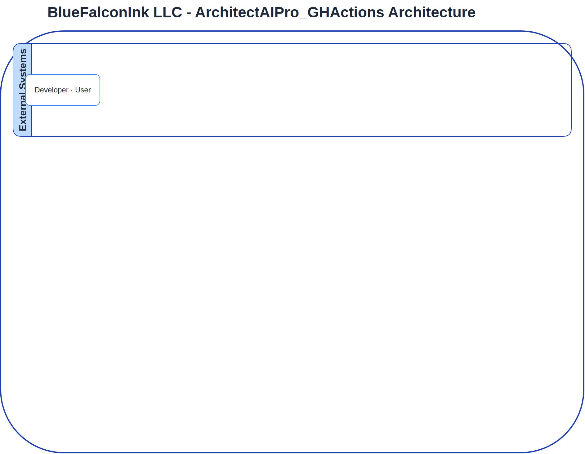

# 🏗️ BlueFalconInk LLC — ArchitectAIPro_GHActions Architecture

> **Created with [Architect AI Pro](https://architect-ai-pro-mobile-edition-484078543321.us-west1.run.app/)** — the flagship architecture tool by **BlueFalconInk LLC**
> Auto-generated on 2026-03-03 00:39 UTC | [GitHub Action source](https://github.com/koreric75/ArchitectAIPro_GHActions)

## Architecture Diagram

📄 View Mermaid Source Code

```mermaid
%% Generated by Architect AI Pro | BlueFalconInk LLC
%% https://architect-ai-pro-mobile-edition-484078543321.us-west1.run.app/
graph TD
    subgraph BFI_Arch [BlueFalconInk LLC - ArchitectAIPro_GHActions Architecture]
        subgraph ExternalSG [External Systems]
            User[User]
            GitHub[GitHub.com]
            GeminiAPI[Google Gemini API]
        end

        subgraph SecuritySG [Security]
            CloudCDN[Cloud CDN]
            LoadBalancer[Cloud Load Balancer]
            CloudArmor[Cloud Armor]
            WIF[Workload Identity Federation]
            SecretManager[Secret Manager]
        end

        subgraph DevOpsSG [CI/CD & Governance]
            GHActions[GitHub Actions Workflows]
            CloudBuild[Cloud Build]
            Terraform[Terraform IaC]
            ArchitectAIScripts[Architect AI Pro Scripts]
            DrawIO[Draw.io CLI - headless]
            Trivy[Trivy Scanner]
        end

        subgraph ApplicationSG [BlueFalconInk Applications]
            CHADDashboard[CHAD Dashboard - Cloud Run]
            ArchGallery[Architecture Gallery - Cloud Run]
        end

        subgraph DataSG [Data Storage]
            ArtifactRegistry[Artifact Registry]
            GitHubRepos[GitHub Repositories]
            StaticData[CHAD Static Data - Local]
        end

        %% External User Access
        User -->|Accesses Web UI| CloudCDN
        CloudCDN -->|Dynamic Content| LoadBalancer
        LoadBalancer --> CloudArmor
        CloudArmor -->|HTTPS| CHADDashboard
        CloudArmor -->|HTTPS| ArchGallery

        %% CHAD Dashboard Interactions
        CHADDashboard -->|API Calls| GitHub
        CHADDashboard -->|Reads/Writes Audit Data| StaticData
        CHADDashboard -->|Fetches GITHUB_PAT| SecretManager
        CHADDashboard -->|Triggers Self-Refresh| CHADDashboard

        %% Architecture Gallery Interactions
        ArchGallery -->|API Calls| GitHub
        ArchGallery -->|Fetches GITHUB_TOKEN| SecretManager

        %% GitHub Actions Orchestration
        User -->|Push/PR/Dispatch| GHActions
        GHActions -->|Auth via WIF| WIF
        WIF -->|GCP Credentials| GHActions
        GHActions -->|Executes Python Scripts| ArchitectAIScripts
        ArchitectAIScripts -->|Generates Diagram Text| GeminiAPI
        ArchitectAIScripts -->|Renders Image| DrawIO
        ArchitectAIScripts -->|Commits Docs/Reports| GitHubRepos
        ArchitectAIScripts -->|Reads Code for Audit| GitHubRepos

        %% Deployment Pipelines
        GHActions -->|Triggers Build| CloudBuild
        CloudBuild -->|Builds Docker Image| GitHubRepos
        CloudBuild -->|Scans Image| Trivy
        CloudBuild -->|Pushes Image| ArtifactRegistry
        GHActions -->|Deploys Image| CHADDashboard
        GHActions -->|Deploys Image| ArchGallery
        GHActions -->|Executes IaC| Terraform
        Terraform -->|Manages GCP Resources| ArtifactRegistry
        Terraform -->|Manages GCP Resources| SecretManager
        Terraform -->|Manages GCP Resources| CHADDashboard
        Terraform -->|Manages GCP Resources| ArchGallery

        %% Data Flow for Generated Content
        GitHubRepos -->|Diagrams/Reports| ArchGallery
        GitHubRepos -->|Diagrams/Reports| CHADDashboard
        StaticData -->|Serves Audit Report| CHADDashboard

    end

        subgraph DataSG [Data Storage]
            AR[Artifact Registry]
    style SecuritySG fill:#1E40AF,color:#BFDBFE
    style FrontendSG fill:#1E3A5F,color:#BFDBFE
    style DataSG fill:#0F172A,color:#BFDBFE
    FOOTER[🏗️ Created with Architect AI Pro · BlueFalconInk LLC]

    style SecuritySG fill:#1E40AF,color:#BFDBFE
    style ApplicationSG fill:#1E3A5F,color:#BFDBFE
    style DataSG fill:#0F172A,color:#BFDBFE
    style FOOTER fill:#1E40AF,color:#BFDBFE,stroke:#3B82F6
    end
    end
```

---

## 📋 BlueFalconInk LLC Building Code Compliance

| Standard | Requirement | Status |
|----------|-------------|--------|
| Cloud Provider | GCP | ✅ Enforced |
| IaC | Terraform | ✅ Enforced |
| Orchestration | Cloud Run | ✅ Enforced |
| API Standard | REST/GraphQL | ✅ Enforced |
| Security Boundary | Required | ✅ Enforced |
| Cloud Armor / LB for Public | Required | ✅ Enforced |
| Brand Identity | BlueFalconInk LLC | ✅ Enforced |

---

## 🏢 About

This architecture diagram was generated by **[Architect AI Pro](https://architect-ai-pro-mobile-edition-484078543321.us-west1.run.app/)**, the flagship
architecture tool built by **BlueFalconInk LLC**. Architect AI Pro analyzes your source code and
produces compliant, production-ready architecture diagrams using Google Gemini AI.

📎 **Live App:** [https://architect-ai-pro-mobile-edition-484078543321.us-west1.run.app/](https://architect-ai-pro-mobile-edition-484078543321.us-west1.run.app/)
📎 **GitHub Actions:** [https://github.com/koreric75/ArchitectAIPro_GHActions](https://github.com/koreric75/ArchitectAIPro_GHActions)

---

*© BlueFalconInk LLC. All rights reserved. Automated Governance. Living Blueprints. Ruthless Consistency.*
