# 🏗️ BlueFalconInk LLC — ArchitectAIPro_GHActions Architecture

> **Created with [Architect AI Pro](https://architect-ai-pro-mobile-edition-484078543321.us-west1.run.app/)** — the flagship architecture tool by **BlueFalconInk LLC**
> Auto-generated on 2026-02-28 20:45 UTC | [GitHub Action source](https://github.com/koreric75/ArchitectAIPro_GHActions)

## Architecture Diagram

```mermaid
%% Generated by Architect AI Pro | BlueFalconInk LLC
%% https://architect-ai-pro-mobile-edition-484078543321.us-west1.run.app/
graph TD
    subgraph BFI_Arch [BlueFalconInk LLC - ArchitectAIPro_GHActions Architecture]
        subgraph SecuritySG [Security]
            CLB[Cloud Load Balancer]
            CloudArmor[Cloud Armor]
            CloudIAM[Cloud IAM · WIF]
        end

        subgraph FrontendSG [Frontend Applications]
            CDN[Cloud CDN]
            CHADDash[CHAD Dashboard - Cloud Run]
            ArchGallery[Architecture Gallery - Cloud Run]
        end

        subgraph DataSG [Data & Secrets]
            ArtifactReg[Artifact Registry]
            SecretMan[Secret Manager]
        end

        subgraph DevOpsSG [DevOps & Automation]
            GHActions[GitHub Actions Runner]
            CloudBuild[Cloud Build]
            Terraform[Terraform IaC]
            ArchGen[Architect AI Pro Generator]
            Foreman[Foreman Audit Engine]
            ChadAuditor[CHAD Repo Auditor]
            ChadDashGen[CHAD Dashboard Generator]
            ChadCleanup[CHAD Cleanup Agent]
            ChadOpsGen[CHAD Ops Page Generator]
        end

        subgraph ExternalSG [External Integrations]
            GeminiAPI[Google Gemini API]
            GitHubAPI[GitHub API]
        end

        User[End User]

        %% Flows
        User -->|HTTPS Request| CLB
        CLB -->|WAF Rules| CloudArmor
        CloudArmor -->|Traffic| CDN
        CDN -->|Serves Content| CHADDash
        CDN -->|Serves Content| ArchGallery

        CHADDash -->|API Calls HTTPS| GitHubAPI
        CHADDash -->|Retrieves Token| SecretMan
        ArchGallery -->|API Calls HTTPS| GitHubAPI
        ArchGallery -->|Retrieves Token| SecretMan

        GHActions -->|Triggers Script| ArchGen
        GHActions -->|Triggers Script| Foreman
        GHActions -->|Triggers Script| ChadAuditor
        GHActions -->|Triggers Script| ChadDashGen
        GHActions -->|Triggers Script| ChadCleanup
        GHActions -->|Triggers Script| ChadOpsGen
        GHActions -->|Terraform Plan/Apply| Terraform
        GHActions -->|Triggers Build| CloudBuild
        GHActions -->|Authenticates via| CloudIAM

        ArchGen -->|Generates Diagram| GeminiAPI
        ArchGen -->|Reads/Commits Code| GitHubAPI
        Foreman -->|Audits Diagram| GitHubAPI
        ChadAuditor -->|Scans Repos| GitHubAPI
        ChadAuditor -->|Generates Report| ChadDashGen
        ChadAuditor -->|Generates Report| ChadOpsGen
        ChadCleanup -->|Modifies Repos| GitHubAPI

        CloudBuild -->|Builds & Scans Image| ArtifactReg
        ArtifactReg -->|Deploys Image to| CHADDash
        ArtifactReg -->|Deploys Image to| ArchGallery

        Terraform -->|Manages Resources| CloudIAM
        Terraform -->|Manages Resources| ArtifactReg
        Terraform -->|Manages Resources| SecretMan
        Terraform -->|Manages Resources| CHADDash
        Terraform -->|Manages Resources| ArchGallery

    end

    FOOTER[🏗️ Created with Architect AI Pro · BlueFalconInk LLC]

    %% Styling
    style BFI_Arch fill:#1E3A5F,color:#BFDBFE
    style SecuritySG fill:#1E40AF,color:#BFDBFE
    style FrontendSG fill:#1E3A5F,color:#BFDBFE
    style DataSG fill:#0F172A,color:#BFDBFE
    style DevOpsSG fill:#1E3A5F,color:#BFDBFE
    style ExternalSG fill:#1E3A5F,color:#BFDBFE
    style FOOTER fill:#1E40AF,color:#BFDBFE,stroke:#3B82F6
    style Security fill:#1E40AF,color:#BFDBFE
    style Data fill:#0F172A,color:#BFDBFE
```

📄 View Mermaid Source Code

---

## 📋 BlueFalconInk LLC Building Code Compliance

| Standard | Requirement | Status |
|----------|-------------|--------|
| Cloud Provider | GCP | ✅ Enforced |
| IaC | Terraform | ✅ Enforced |
| Orchestration | Cloud Run | ✅ Enforced |
| API Standard | REST/GraphQL | ✅ Enforced |
| Security Boundary | Required | ✅ Enforced |
| Cloud Armor / LB for Public | Required | ✅ Enforced |
| Brand Identity | BlueFalconInk LLC | ✅ Enforced |

---

## 🏢 About

This architecture diagram was generated by **[Architect AI Pro](https://architect-ai-pro-mobile-edition-484078543321.us-west1.run.app/)**, the flagship
architecture tool built by **BlueFalconInk LLC**. Architect AI Pro analyzes your source code and
produces compliant, production-ready architecture diagrams using Google Gemini AI.

📎 **Live App:** [https://architect-ai-pro-mobile-edition-484078543321.us-west1.run.app/](https://architect-ai-pro-mobile-edition-484078543321.us-west1.run.app/)
📎 **GitHub Actions:** [https://github.com/koreric75/ArchitectAIPro_GHActions](https://github.com/koreric75/ArchitectAIPro_GHActions)

---

*© BlueFalconInk LLC. All rights reserved. Automated Governance. Living Blueprints. Ruthless Consistency.*
