# BlueFalconInk Architecture Diagram

> This file is auto-generated by **Architect AI Pro** on every push to `main`.
> Do not edit manually — changes will be overwritten.

```mermaid
%% BlueFalconInk Architecture Standard v1.0
%% Generated by Architect AI Pro

graph TB
    subgraph Security["🛡️ Security Boundary"]
        WAF[AWS WAF]
        ALB[Application Load Balancer]
    end

    subgraph Application["🏗️ BlueFalconInk Platform"]
        API[FastAPI Backend]
        Worker[Async Worker]
        ArchAI[Architect AI Engine]
    end

    subgraph Data["💾 Data Layer"]
        DB[(PostgreSQL)]
        Cache[(Redis)]
        S3[AWS S3 Storage]
    end

    subgraph CDN["🌐 Content Delivery"]
        CF[AWS CloudFront]
    end

    subgraph Payment["💳 Payment Boundary"]
        Stripe[Stripe API]
        Webhook[Webhook Handler]
    end

    Internet((Public Internet)) --> WAF
    WAF --> ALB
    ALB --> API
    API --> ArchAI
    API --> DB
    API --> Cache
    API --> Worker
    Worker --> S3
    S3 --> CF
    CF --> Internet
    Stripe --> Webhook
    Webhook --> API

    style Security fill:#1E40AF,color:#BFDBFE
    style Application fill:#1E3A5F,color:#BFDBFE
    style Data fill:#0F172A,color:#BFDBFE
    style CDN fill:#1E3A5F,color:#BFDBFE
    style Payment fill:#7C3AED,color:#BFDBFE
```

---

*Last updated by Architect AI Pro — BlueFalconInk Standard v1.0*
